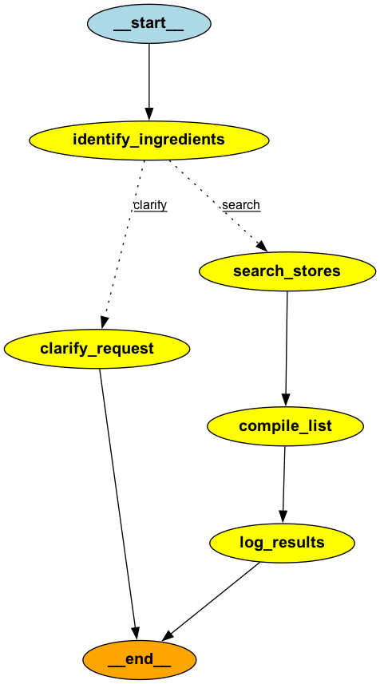

# AgentBench 🔬🤖

[](https://opensource.org/licenses/MIT)
[](https://www.python.org/downloads/)
[](https://www.langchain.com/)

An open-source, autonomous **"Red Team" framework** for stress-testing and evaluating AI agents.

The core of this project is the **`RedTeamCommander`**, an intelligent agent designed to solve one of the hardest problems in AI development: How do you find your agent's weaknesses before your users do?

Our approach is a unique, interactive "glass box" testing method. Instead of treating your agent as a black box, the `RedTeamCommander` collaborates with you to build a deep and accurate understanding of its capabilities, and then uses that understanding to generate a powerful and comprehensive test suite.

### The Autonomous Workflow

The `RedTeamCommander` is designed to be your expert QA partner. Here's how it works:

1.  **Targeted Code Analysis (RAG):** You don't give it any instructions. You simply point it directly to your agent's "brain" by listing the key source code files in a simple config. The commander ingests and analyzes only this relevant code to build its initial understanding - fully autonomously

2.  **AI-Powered Deduction:** It uses a Retrieval-Augmented Generation (RAG) pipeline to analyze the code and produce a detailed, step-by-step summary of what it thinks your agent does, from its core logic paths to its specific tools.

3.  **Human-in-the-Loop Verification:** This is the crucial step. The commander presents its analysis to you and asks for feedback. It shows you what it has learned and asks you to fill in any missing blanks or correct its assumptions. This ensures the tests are grounded in reality, not AI hallucination.

4.  **Autonomous Test Generation:** Armed with a perfect, human-verified understanding of your agent, the commander then autonomously generates a rich and diverse suite of test cases. It creates unique user personas and challenging queries designed to probe your agent's specific capabilities, edge cases, and potential failure points.

Here is a the graphical representation of the steps


The end result is a high-quality, auto-generated test file that is far far more comprehensive than what could be written by hand. 


This repository contains both the `RedTeamCommander` framework and a complete example "Blue Team" agent (`MexicanGroceriesBot`) to demonstrate the full end-to-end workflow.

Here's a look at the "Blue Team" agent's decision graph—a visual map of the kind of complex, agentic workflows you can build and then immediately test with AgentScope.


### 🗺️ How This Repository is Organized

I structured this project to keep all the related parts together. Here's a brief overview:

```
/
├── core_lib/                 # Reusable tools I built for the framework.
│   ├── metric_engine.py      # The engine that parses your YAML and calculates metrics.
│   ├── assertion_engine.py   # The engine for running pass/fail quality checks.
│   └── ...                   # Connectors, other tools.
│
├── projects/
│   └── mexican_groceries/    # A complete example agent to play with.
│       ├── agent.py          # The agent's core logic (built with LangGraph).
│       ├── evaluation/       # The YAML config files for testing this agent.
│       └── ...
│
└── synthetic_users/          # The scripts for running evaluations and analytics.
    ├── local_evaluator.py    # script to run batch analysis on your agent's logs.
    └── e2e_evaluator.py      # script to run tests against the live Discord bot.
```
---
### Getting Started

This guide will get you from cloning the repository to having a agent on Discord, ready to be analysed by the RedTeam.

**1. Prerequisites**

You'll need Python 3.10 or newer and Git installed on your machine.

**2. Installation**

First, clone the project and cd into the directory.

```bash
git clone https://github.com/Murasaki-Z/AgentBench.git
cd AgentBench
```

> **Note:** It's a good idea to create a virtual environment to keep your dependencies clean.

Now, install all the required libraries from the `requirements.txt` file.

```bash
pip install -r requirements.txt
```

**3. Configuration**

The project uses a `.env` file to handle secret API keys. I have included a template to make this easy.

*   Find the file named `.env.example` in the main directory.
*   Make a copy of it and rename the copy to just `.env`.
*   Open your new `.env` file and fill in your own API keys. You'll need keys from OpenAI and Google (for Gemini), as well as a token for your Discord bot.


### The Evaluation & Red Teaming Workflow

This is where the magic happens. Here's the recommended workflow.

Step 1: Generate Tests with the `RedTeamCommander`
Run our autonomous test designer. It will analyze the cooking bot's code and then interactively work with you to generate a high-quality test file.

```bash
python synthetic_users/run_red_team.py
```
This will create a new file: test_cases_autogenerated.py. For now, you can manually rename this to test_cases.py to use it in the next steps.

I have include a full run example [here](projects/example_run_red_team.txt)

Step 2: Run End-to-End Tests

Now, test your live bot against the new, AI-generated test suite.

Terminal 1: Make sure your live bot is running.
```bash
python -m projects.mexican_groceries
```
Terminal 2: Run the E2E evaluator.

```bash
python synthetic_users/online_evaluator.py
```

This gives you a high-level quality score for your agent's performance in a production-like environment.

Step 3: Analyze Production Logs

After you've played with the bot yourself, you can run our batch analyzer on the logs it generated. This script uses your metrics_definition.yaml to create a detailed performance report.

```bash
python synthetic_users/local_evaluator.py --hours 24
```
This will show you objective KPIs, like how often each logical path was taken and the average success rate of its tools.

### Future Vision & Contributing

This project is an active and ambitious journey. Our roadmap is focused on making the ecosystem even more autonomous and intelligent, with features like:
Giving the main agent conversational memory.
Creating an automated feedback loop where production failures are used to generate new test cases.
We believe that building trustworthy AI requires a new generation of open-source tools. If this mission resonates with you, feel free to open an issue with your ideas or submit a pull request
